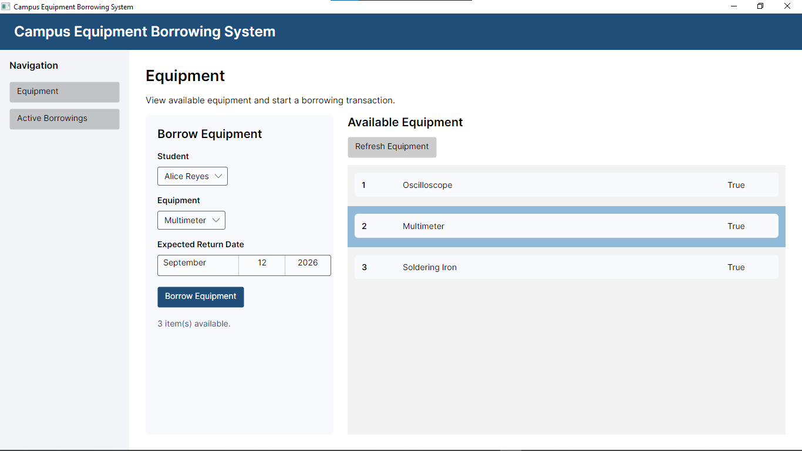
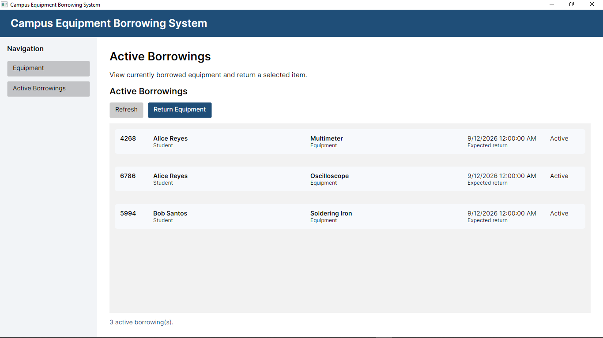
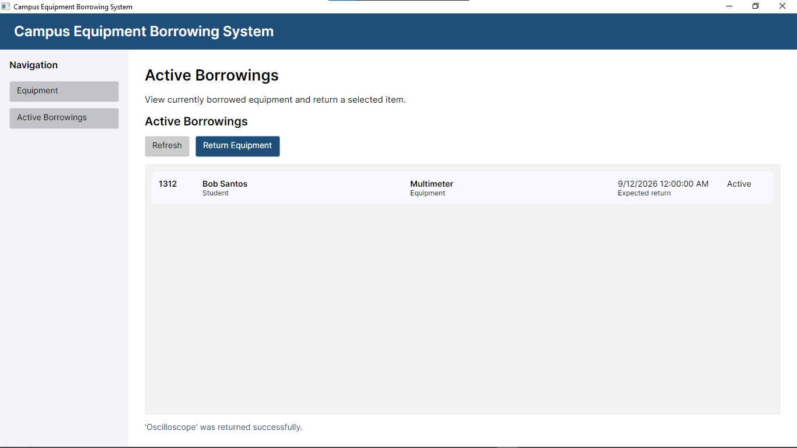
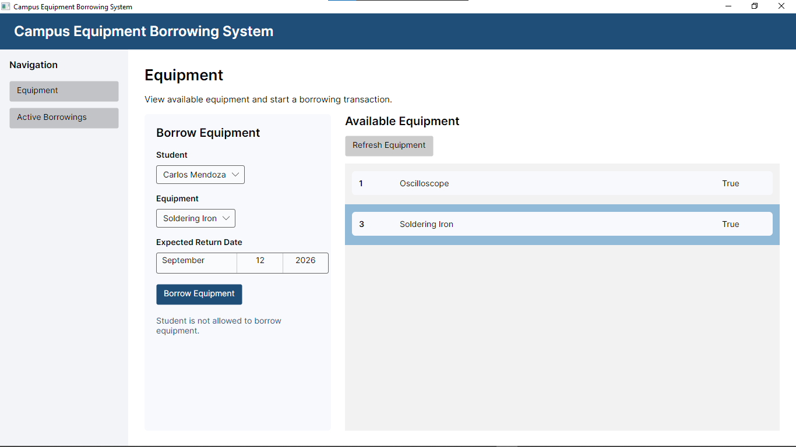
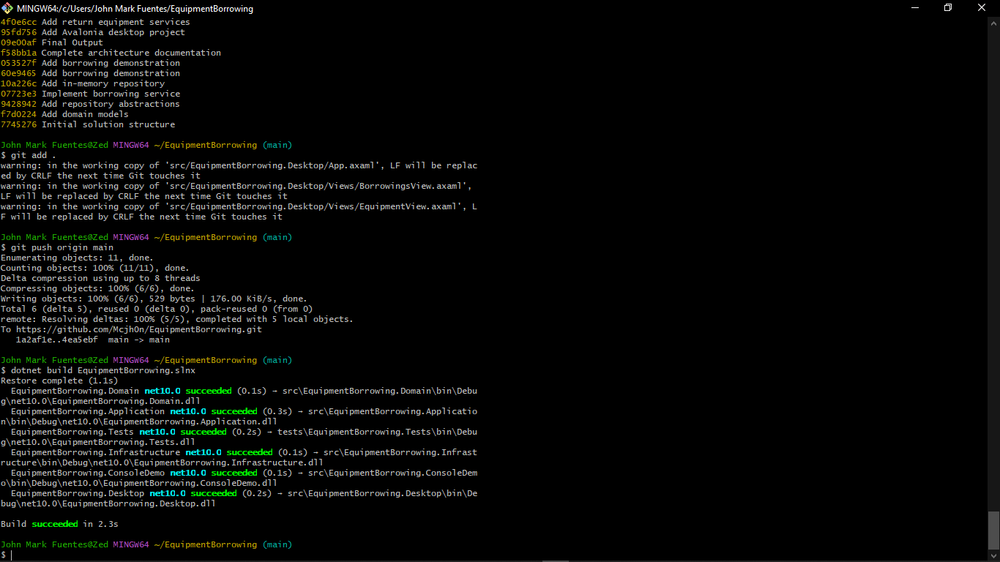

# Equipment Borrowing System

A C# and .NET project that shows how to borrow and return equipment in a school laboratory.
This project does not have a real database or a visual interface yet.
It only shows the basic structure and logic of the system.

---

## 1. Solution Structure

The solution has four layers plus a small console program that demonstrates the borrowing use case. Each part has its own job.

### Domain
This is the most important part.
It holds the main ideas of the system — like what a Student, Equipment, and Borrowing are.
It also holds simple rules, like what happens when equipment is borrowed or returned.
This part does not depend on any other part.

### Application
This part holds the actions the system can do — like borrowing or returning equipment.
It talks to the Domain part to use the main ideas.
It also defines "interfaces" — these are like contracts that say what the system needs to do with data, but not how to do it.
This part depends only on the Domain part.

### Infrastructure
This part holds the actual code that stores and reads data.
Right now, it uses a simple list in memory to store data (no real database yet).
Later, this part can be changed to use a real database like SQLite without changing the other parts.
This part depends on both the Domain and Application parts.

### Tests
This part holds the tests that check if the system works correctly.
It depends on the Domain and Application parts.

### ConsoleDemo
This is the executable composition root. It creates the in-memory repositories, passes them to `BorrowEquipmentService`, and runs both successful and unsuccessful borrowing requests.
It depends on the Domain, Application, and Infrastructure projects so it can wire the layers together manually.

---

## 2. Dependency Direction

This shows which part depends on which other part:

```
ConsoleDemo (or future Avalonia UI)
              |
              v
        Application <--- Infrastructure
              |
              v
            Domain
```

- **Domain** does not need any other part.
- **Application** only needs the Domain part.
- **Infrastructure** needs both the Domain and Application parts.
- **ConsoleDemo** references all three layers only to compose the concrete infrastructure implementations with the application service.

---

## 3. Use Case Mapping

This shows how one feature of the system works from start to finish.

```
Actor:                      Student
Use Case:                   Borrow Equipment
Application Service:        BorrowEquipmentService
Domain Objects Used:        Student, Equipment, Borrowing, BorrowingStatus
Repository Interfaces Used: IStudentRepository, IEquipmentRepository, IBorrowingRepository
Infrastructure Used:        InMemoryStudentRepository, InMemoryEquipmentRepository, InMemoryBorrowingRepository
```

---

## 4. Reflection

**1. Why should the application service use an interface instead of connecting directly to a database?**

When the service uses an interface, it does not care where the data comes from.
The data can come from memory, a file, or a database — and the service code stays the same.
This also makes it easier to test the service without needing a real database.

**2. Which parts will stay the same if we add a real database like SQLite later?**

The Domain and Application parts will not change at all.
Only the Infrastructure part will change — we just add new code there to connect to SQLite.
The rest of the system does not need to know about this change.

**3. Which part will hold the Avalonia UI screens in the future?**

A new part called something like `EquipmentBorrowing.Desktop` will hold the Avalonia screens.
This part will be on the outside and will call the Application part to do the work.

**4. Should a button on the screen directly run database code?**

No. A button should only call the application service.
The service will do the checking and the saving.
If we put database code inside a button, the code becomes messy and hard to fix or test later.

**5. Which part of the code represents the actual task the student wants to do?**

The `BorrowEquipmentService.ExecuteAsync` method is the main action.
It checks all the rules — like if the student is allowed to borrow, if the equipment is available, and if the student has not borrowed too many items already.
If all checks pass, it saves the borrowing record.

---

## 5. Laboratory Activity 2 - Avalonia UI and MVVM

### Activity 1 Note

The earlier part of this README says that the project has no visual interface.
That was true in Activity 1.

Activity 2 adds an Avalonia desktop application. The project still uses in-memory data, so it does not use a real database yet.

### What Was Added

The new desktop project is `src/EquipmentBorrowing.Desktop`.

The application can:

- Show available equipment
- Let a user choose a student, equipment, and return date
- Borrow equipment
- Show active borrowings
- Return selected equipment
- Show success and error messages

### MVVM and Application Flow

The desktop application uses the MVVM pattern.

```text
View
  |
  v
ViewModel
  |
  v
Application Service
  |
  v
Repository Interface
  |
  v
In-Memory Repository
```

- The **View** is the screen that the user sees.
- The **ViewModel** holds screen data and commands.
- The **Application Service** performs borrowing and return actions.
- The **Repository Interface** is the contract for getting and saving data.
- The **In-Memory Repository** stores data while the application is open.

The View does not contain borrowing rules. The ViewModel calls the application services instead of directly using a repository.

### Dependency Injection

`App.axaml.cs` connects the ViewModels, application services, and repositories.

The repositories are registered as singletons. This means the Equipment page and Active Borrowings page use the same data while the app is open.

### How to Run the Application

Open a terminal in the project folder and run:

```powershell
dotnet build EquipmentBorrowing.slnx
dotnet run --project src/EquipmentBorrowing.Desktop
```

### Screenshots


#### Equipment Page

The Equipment page shows available equipment and the borrow form.



#### Active Borrowings After Borrowing

This page shows the active borrowing records after equipment was borrowed.



#### Successful Return

This message shows that the Oscilloscope was returned successfully.



#### Handled Validation Error

This message shows a rule check. The selected student is not allowed to borrow equipment.



#### Build and Git History

This screenshot shows a successful `dotnet build` and meaningful Git commits.



### Reflection

**Why use a ViewModel?**

A ViewModel keeps the screen code separate from the user interface. This makes the project easier to read and change.

**Why call an application service from the ViewModel?**

The application service contains the borrowing and return rules. Both the console application and the desktop application can use the same rules.

**Why use singleton repositories?**

Singleton repositories keep one shared list of data while the desktop application is open. This lets borrowed and returned items appear correctly on both screens.
