# Equipment Borrowing System

A C# and .NET project that shows how to borrow and return equipment in a school laboratory.
It began as an in-memory domain/application demonstration, gained an Avalonia interface in Activity 2, and now uses SQLite and Entity Framework Core for persistent storage in Activity 3.

---

## 1. Solution Structure

The solution has four layers plus a small console program that demonstrates the borrowing use case. Each part has its own job.

### Domain
This is the most important part.
It holds the main ideas of the system — like what a Student, Equipment, and Borrowing are.
It also holds simple rules, like what happens when equipment is borrowed or returned.
This part does not depend on any other part.

### Application
This part holds the actions the system can do — like borrowing or returning equipment.
It talks to the Domain part to use the main ideas.
It also defines "interfaces" — these are like contracts that say what the system needs to do with data, but not how to do it.
This part depends only on the Domain part.

### Infrastructure
This part holds the actual code that stores and reads data.
The original Activity 1 repositories used lists in memory. Activity 3 adds EF Core repositories backed by SQLite; the in-memory repositories remain available for the console demonstration.
This part depends on both the Domain and Application parts.

### Tests
This part holds the tests that check if the system works correctly.
It depends on the Domain and Application parts.

### ConsoleDemo
This is the executable composition root. It creates the in-memory repositories, passes them to `BorrowEquipmentService`, and runs both successful and unsuccessful borrowing requests.
It depends on the Domain, Application, and Infrastructure projects so it can wire the layers together manually.

---

## 2. Dependency Direction

This shows which part depends on which other part:

```
ConsoleDemo (or future Avalonia UI)
              |
              v
        Application <--- Infrastructure
              |
              v
            Domain
```

- **Domain** does not need any other part.
- **Application** only needs the Domain part.
- **Infrastructure** needs both the Domain and Application parts.
- **ConsoleDemo** references all three layers only to compose the concrete infrastructure implementations with the application service.

---

## 3. Use Case Mapping

This shows how one feature of the system works from start to finish.

```
Actor:                      Student
Use Case:                   Borrow Equipment
Application Service:        BorrowEquipmentService
Domain Objects Used:        Student, Equipment, Borrowing, BorrowingStatus
Repository Interfaces Used: IStudentRepository, IEquipmentRepository, IBorrowingRepository
Infrastructure Used:        InMemoryStudentRepository, InMemoryEquipmentRepository, InMemoryBorrowingRepository
```

---

## 4. Reflection

**1. Why should the application service use an interface instead of connecting directly to a database?**

When the service uses an interface, it does not care where the data comes from.
The data can come from memory, a file, or a database — and the service code stays the same.
This also makes it easier to test the service without needing a real database.

**2. Which parts will stay the same if we add a real database like SQLite later?**

The Domain and Application parts will not change at all.
Only the Infrastructure part will change — we just add new code there to connect to SQLite.
The rest of the system does not need to know about this change.

**3. Which part will hold the Avalonia UI screens in the future?**

A new part called something like `EquipmentBorrowing.Desktop` will hold the Avalonia screens.
This part will be on the outside and will call the Application part to do the work.

**4. Should a button on the screen directly run database code?**

No. A button should only call the application service.
The service will do the checking and the saving.
If we put database code inside a button, the code becomes messy and hard to fix or test later.

**5. Which part of the code represents the actual task the student wants to do?**

The `BorrowEquipmentService.ExecuteAsync` method is the main action.
It checks all the rules — like if the student is allowed to borrow, if the equipment is available, and if the student has not borrowed too many items already.
If all checks pass, it saves the borrowing record.

---

## 5. Laboratory Activity 2 - Avalonia UI and MVVM

### Activity 1 Note

The earlier part of this README describes the original Activity 1 structure.

Activity 2 added an Avalonia desktop application using in-memory data. Activity 3 replaces the Desktop application's in-memory registrations with SQLite-backed repositories.

### What Was Added

The new desktop project is `src/EquipmentBorrowing.Desktop`.

The application can:

- Show available equipment
- Let a user choose a student, equipment, and return date
- Borrow equipment
- Show active borrowings
- Return selected equipment
- Show success and error messages

### MVVM and Application Flow

The desktop application uses the MVVM pattern.

```text
View
  |
  v
ViewModel
  |
  v
Application Service
  |
  v
Repository Interface
  |
  v
In-Memory Repository
```

- The **View** is the screen that the user sees.
- The **ViewModel** holds screen data and commands.
- The **Application Service** performs borrowing and return actions.
- The **Repository Interface** is the contract for getting and saving data.
- The **In-Memory Repository** stores data while the application is open.

The View does not contain borrowing rules. The ViewModel calls the application services instead of directly using a repository.

### Dependency Injection

`App.axaml.cs` connects the ViewModels, application services, and repositories. In Activity 3 it registers EF Core's `IDbContextFactory<EquipmentBorrowingDbContext>` and the EF-backed repositories. Each repository operation creates and disposes its own short-lived context, while the database file preserves data between application runs.

### How to Run the Application

Open a terminal in the project folder and run:

```powershell
dotnet build EquipmentBorrowing.slnx
dotnet run --project src/EquipmentBorrowing.Desktop
```

### Screenshots


#### Equipment Page

The Equipment page shows available equipment and the borrow form.

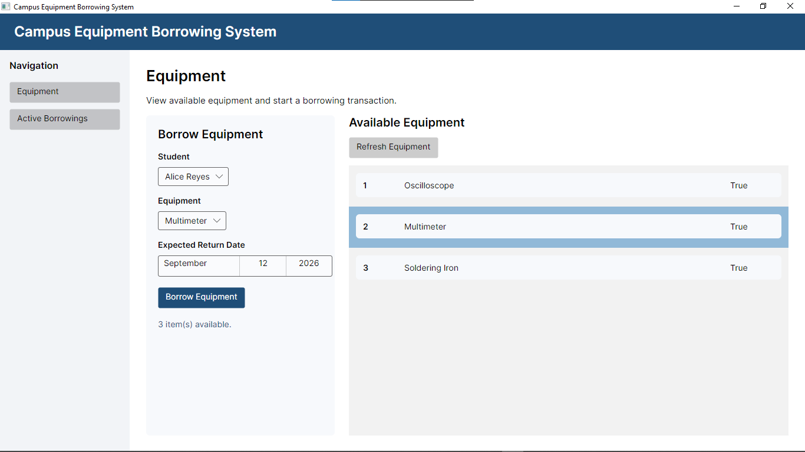

#### Active Borrowings After Borrowing

This page shows the active borrowing records after equipment was borrowed.

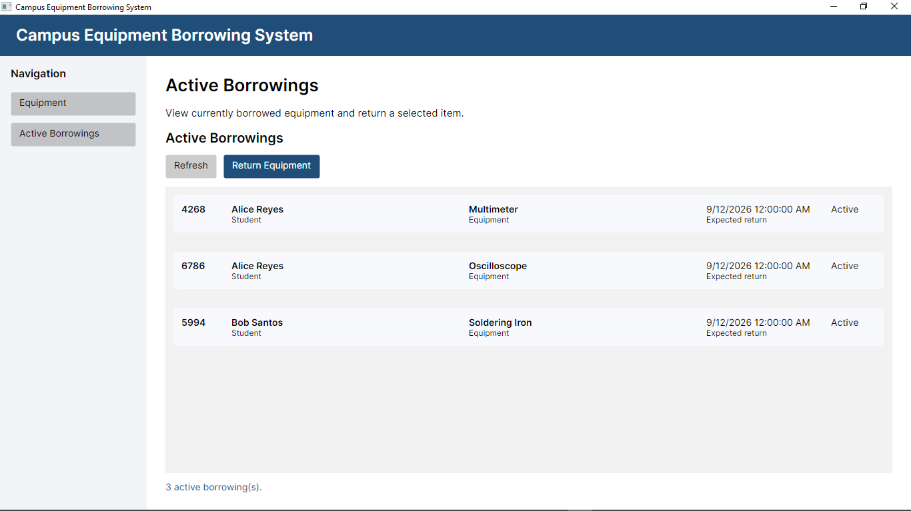

#### Successful Return

This message shows that the Oscilloscope was returned successfully.

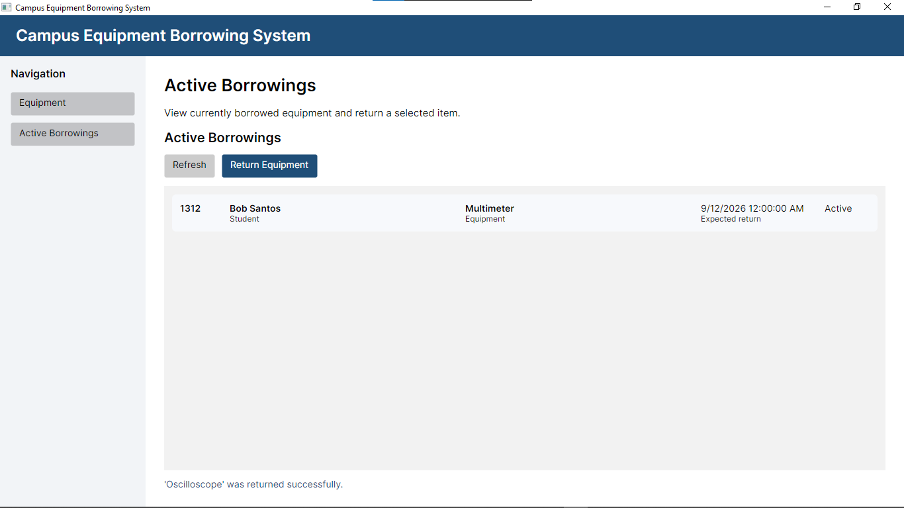

#### Handled Validation Error

This message shows a rule check. The selected student is not allowed to borrow equipment.

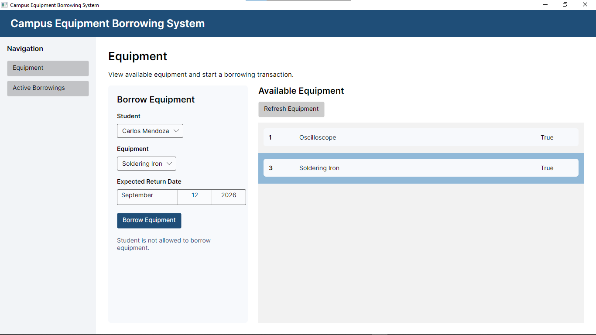

#### Build and Git History

This screenshot shows a successful `dotnet build` and meaningful Git commits.

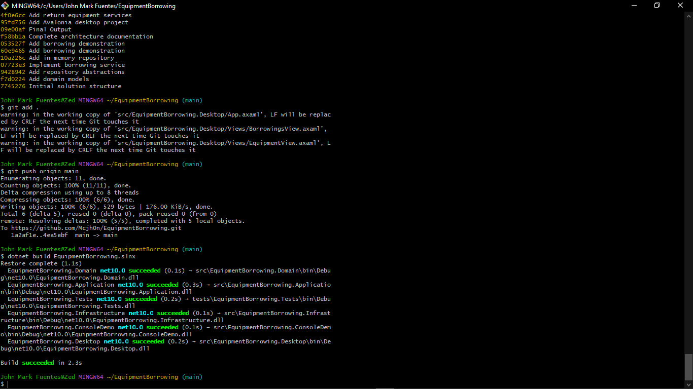

### Reflection

**Why use a ViewModel?**

A ViewModel keeps the screen code separate from the user interface. This makes the project easier to read and change.

**Why call an application service from the ViewModel?**

The application service contains the borrowing and return rules. Both the console application and the desktop application can use the same rules.

**Why use singleton repositories?**

In the original Activity 2 implementation, singleton repositories shared one in-memory list while the application was open. Activity 3 uses a SQLite database and short-lived EF Core contexts instead, so saved borrowings remain available after the application closes.

## 6. Laboratory Activity 3 - SQLite and Entity Framework Core

### Database design

The database has three tables: `Students`, `Equipment`, and `Borrowings`. Each table has an integer primary key. `Borrowings.StudentId` and `Borrowings.EquipmentId` are required foreign keys. A student and an equipment item can each have multiple borrowing records over time. The foreign keys use restricted deletes so a referenced student or item cannot be deleted while borrowing history refers to it. Borrowing status is stored as an integer (`Active = 0`, `Returned = 1`).

The diagram is in [docs/database-diagram.png](docs/database-diagram.png). SQL examples are in [docs/database-queries.sql](docs/database-queries.sql).

### SQLite, DbContext, and repositories

The Infrastructure project uses `Microsoft.EntityFrameworkCore.Sqlite`. `EquipmentBorrowingDbContext` exposes the three sets, and separate entity configurations define keys, required fields, maximum name lengths, enum conversion, foreign keys, delete behavior, and indexes.

`IStudentRepository`, `IEquipmentRepository`, and `IBorrowingRepository` remain the Application boundary. The Desktop application now registers `EfStudentRepository`, `EfEquipmentRepository`, and `EfBorrowingRepository`. These repositories use `IDbContextFactory` to create a fresh context per operation. Views and ViewModels continue to call application services and do not know about SQLite or `DbContext`.

The database file is stored at `%LOCALAPPDATA%/EquipmentBorrowing/equipment-borrowing.db`. At startup, the app applies migrations and inserts three sample students and three equipment items only when their respective tables are empty. Existing data is not deleted or reseeded on each run.

### Migrations

The repository includes a local EF tool manifest (`dotnet-tools.json`) and the initial migration under `src/EquipmentBorrowing.Infrastructure/Persistence/Migrations`.

```powershell
dotnet tool restore
dotnet tool run dotnet-ef migrations add AddYourChange `
  --project src/EquipmentBorrowing.Infrastructure `
  --startup-project src/EquipmentBorrowing.Desktop `
  --output-dir Persistence/Migrations

dotnet tool run dotnet-ef database update `
  --project src/EquipmentBorrowing.Infrastructure `
  --startup-project src/EquipmentBorrowing.Desktop
```

The desktop startup also calls `Database.MigrateAsync()` through the database initializer. EF Core records applied migrations in `__EFMigrationsHistory`.

### LINQ queries, generated SQL, and tracking

The repositories demonstrate LINQ queries for available equipment, active borrowing records with student/equipment details, and active borrowing counts per student. Two corresponding SQL translations and explanations are documented in [docs/generated-sql.md](docs/generated-sql.md). EF Core SQL logging is sent to the .NET trace output during development.

Equipment/student lookups and display lists use `AsNoTracking()` because those results are read-only. The return operation reloads the selected borrowing and its related equipment, then explicitly persists the changed status and availability fields.

### Persistence demonstration

The Desktop application can be started with:

```powershell
dotnet run --project src/EquipmentBorrowing.Desktop
```

To demonstrate the required persistence behavior:

1. Borrow an available item and confirm it appears under Active Borrowings.
2. Close the application and open it again; confirm the borrowing is still listed.
3. Return the item, close and reopen the application, and confirm it remains returned and the equipment is available again.
4. Inspect the SQLite database and confirm it contains `Students`, `Equipment`, `Borrowings`, and `__EFMigrationsHistory`.

Local verification results are recorded in [docs/persistence-verification.md](docs/persistence-verification.md). Run the steps above in the Avalonia window when presenting the activity.

### Architectural reflection

1. **Why was a full rewrite unnecessary?** Application services already depend on repository interfaces, so Infrastructure could provide EF Core implementations behind those same contracts.
2. **Why should a ViewModel not use `DbContext` directly?** That would couple UI code to SQLite and database setup, bypassing the application-service and repository boundaries.
3. **What does the repository implementation do?** It translates application data requests into asynchronous EF Core queries and saves changes to SQLite.
4. **What is an EF Core migration for?** It records reproducible schema changes so databases can be created and upgraded to match the model.
5. **Why are foreign keys important?** They ensure each borrowing refers to real student and equipment records and prevent invalid references.
6. **Why use `AsNoTracking()` for display queries?** It avoids change-tracking work for entities that the operation only reads.
7. **What if SQLite were replaced?** The Infrastructure configuration and repository implementations would change; the Domain, application services, and ViewModels could continue using the same interfaces and workflows.

### Activity 3 Screenshots

#### Build

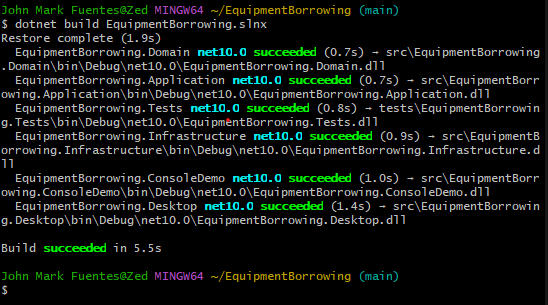

#### Git history

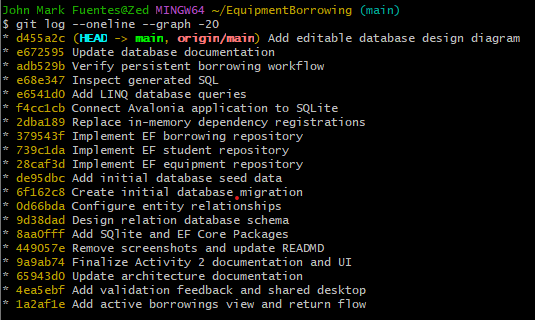

#### Database tables

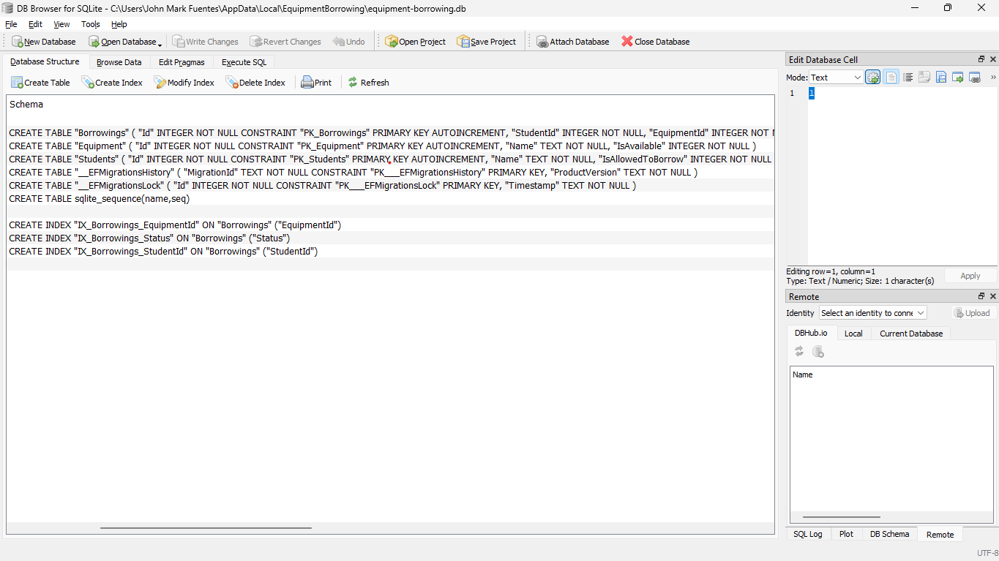

#### Students table data

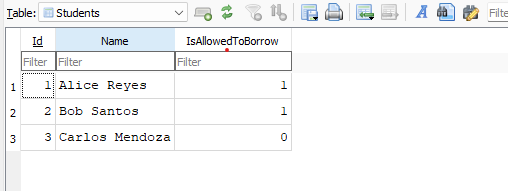

#### Equipment table data

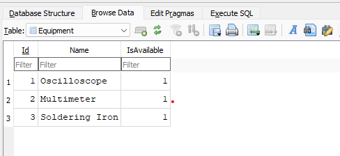

#### Borrowings table data

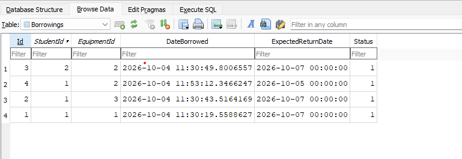

#### Borrowing with student and equipment names

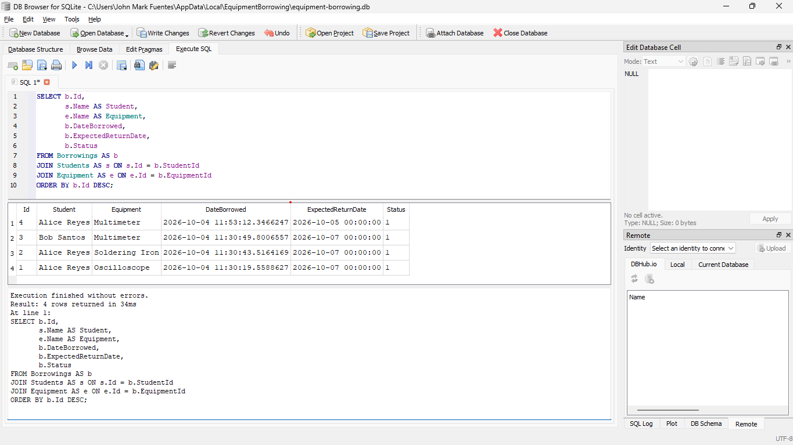

#### Successful borrowing

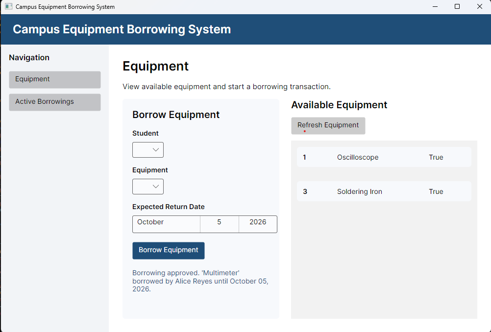

#### Borrowing before restart

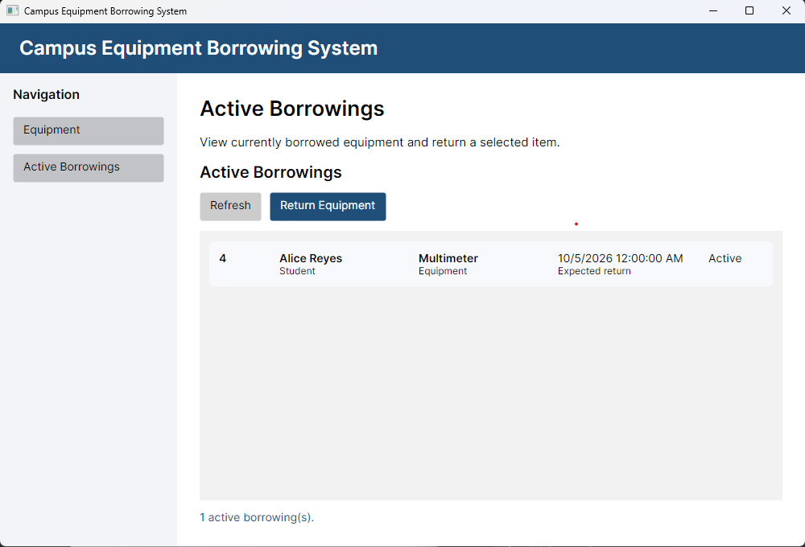

#### Borrowing after restart

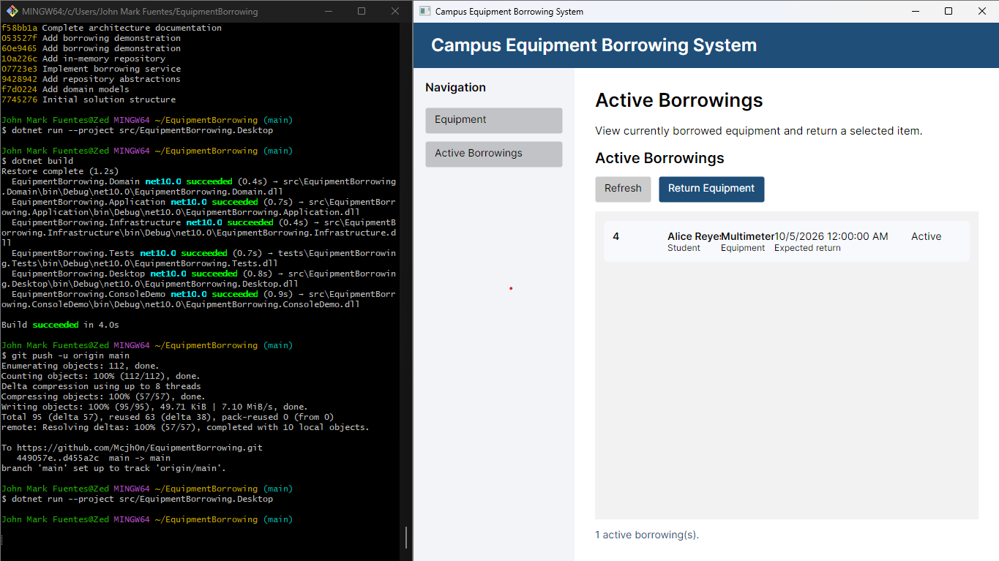

#### Successful return

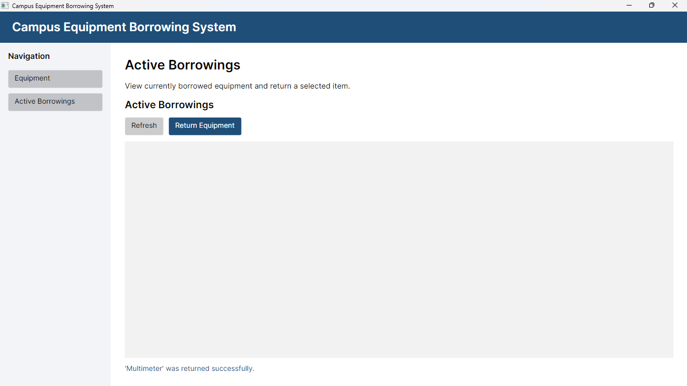
